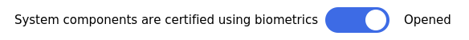
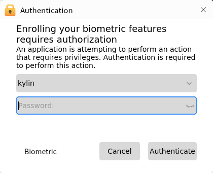

# Biometric Manager
## Overview
Biometric certification is safer and more convient than tranditional passwords. It doesn't need to remember the complex passwords.

Because each person's fingerprint is different from others', it's not easy to forge or fake. Authenticated by fingerprint is more reliable and accurate.

It supports login, lock screen and authorized certification.

In order to use biometric certification, four conditions need to be meet:

1) The device is linked and the driver is opened.

2) Biometrics for authentication is opened.

3) The linked device is set as default.

4) The user's fingerprint has been recorded by this device already.

## Main Interface
As shown in Fig 1, there are four biometric feature pages: FingerPrint, FingerVein, Iris, and VoicePrint.

"System components are certified using biometrics" is the switch to turn on biometrics. 

The left side shows the type of biometric, and the right side shows the devices corresponding this type, including device name, device status, driver status and default. 

If want to use one of them, users need to link the device first and check the default box. As shown in Fig 3.

## Biometric Features
Fingerprint, fingervein, iris and voiceprint pages are similar. Take fingerprint for example here.

The interface as shown in Fig 4:

- Left side shows the driver, and the informations about this driver are shown on the upper right side, including short name, verify type, bus type, etc..

- The middle right side shows fingerprint list, including index and name.

- The bottom right side includes enroll, verify, search,delete and clean functions.

### Enroll
Clicking "Enroll" and inputting the name, the authentication through password window will pop up, as shown in Fig 5.

The enroll window as shown in Fig 6. It needs to repeat pressing and lifting finger 5 times.

### Verify
Selecting a fingerprint and clicking "Verify", it can ensure the accuracy and availability of this fingerprint. The result window will show up when the process finishes.

### Search
It can retrieve the index and name of the currently validated fingerprint.

### Delete and Clean
**Delete**: Delete the selected fingerprint.

**Clean**: Empty all the fingerprints of current user.

## Usage Scenarios
- Login and Lock Screen:

If there exists 2 more devices, users can choose one of them to use.

- Authentication:

 

## Q&A
### Stuck in lock screen and unable to enter password

1) Switch to teminal by "Ctrl + Alt + F1"

2) Enter the user name and password

3) Excute command "killall ukui-screensaver-dialog"

4) Switch back by "Ctrl + Alt + F7" (If multiple users logged in, the command may be Ctrl + Alt + F8 and so on)

### Unable to use biometric authentication

1) Open biometric manager

2) Ensure the switch is on, the device is linked, and the driver status is opened

3) Check the device is set as default

4) Make sure there exits one biometric feature at least

### How to close it
Change the switch on the main interface to "Closed".

