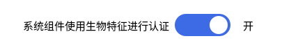
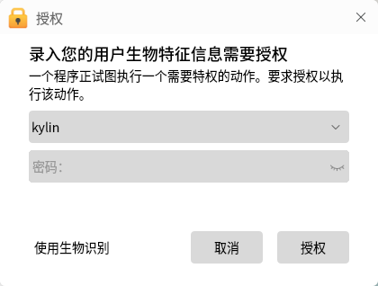
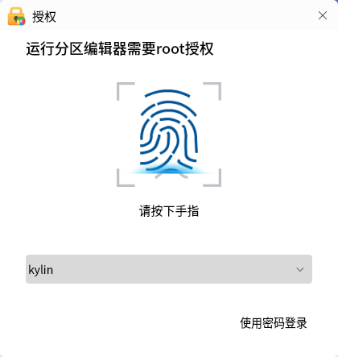

# 生物特征管理工具
## 概 述
介于每个人的指纹等生物特征具有唯一性和稳定性，不易伪造和假冒，利用生物特征进行身份认定，比传统口令密码更安全、可靠、准确。

默认使用生物认证，需要满足4个条件：

1）设备已连接，且驱动状态为打开。

2）系统组件使用生物特征进行认证开关状态为打开。

3）设置连接设备为默认设备。

4）该设备下存在已录入的生物特征。

 

## 主界面
如图1所示，管理工具有四种生物特征标签页：指纹，指静脉，虹膜和声纹。

“系统组件使用生物特征进行认证”是开启生物特征的开关，只有打开这个开关，才能够使用生物认证。

主界面左侧显示了生物特征的类型；右侧显示的是该类型所对应的驱动设备信息，包括设备名称、设备状态、驱动状态，以及是否为默认设备。

当想要使用某种生物特征设备时，需要先连接上该设备，然后将该设备设置为默认设备，如图3所示。

## 生物特征
指静脉，指纹，虹膜和声纹的页面组成是类似的，此处以指纹标签页为例。

指纹页面如图4所示:

- 左侧显示指纹驱动，右侧上半部分显示该驱动所对应的信息，包括设备简称，验证类型，总线类型等。

- 右侧中间显示已录入的指纹信息，包括指纹名称和序列号。

- 右侧底部提供录入，验证，搜索，删除，清空功能。

### 录 入
点击“录入”，出现授权弹窗，如图5所示。

密码验证成功后，即可录入指纹，录入界面如图6所示。之后按照录入窗口上的提示，多次抬起、按压手指，直到完成。

### 验 证
选中一个指纹，点击“验证”，可以确保该特征的准确性和可用性。

### 搜 索
点击“搜索”，可在所有可用的指纹里检索到符合当前验证的指纹对应的序列号和名称。

### 删除和清空
- **删除**：删除选中的指纹。

- **清空**：清空当前用户的所有指纹。

 

## 应用场景
### 登录和锁屏

当存在多个设备时，用户可选择使用任意一个。

### 授权认证

 

## 常见问题
#### 锁屏卡住，无法输入密码
1）通过Ctrl + Alt + F1切换到字符终端。

2）输入锁屏时所在的用户的用户名和密码。

3）执行命令“killall ukui-screensaver-dialog”。

4）通过Ctrl + Alt + F7切回图形界面（如果登录了多个用户，也可能是Ctrl + Alt + F8等）。

 

#### 无法使用生物认证
1）打开生物识别管理工具。

2）确认生物识别开关是否打开，设备是否连接，驱动状态是否打开。

3）查看设备是否设置为默认设备。

4）查看是否录入了指纹。

 

#### 如何关闭生物认证
将主界面上的“系统组件使用生物特征状态”开关关闭。

 

## 附录
### 目前支持的指纹设备列表

| 生物特征 |	厂商 | 型号 | 子型号 |
| :------------ | :------------ | :------------ | :------------ |
|指静脉	|圣点科技	|UD650	|UD650
|虹膜	|北京无线电计量测试研究所|	A210|	A210
|指纹(共 21 个驱动,支持10 个厂商的 122 款设备)|	杭州城章科技|	R301	|R301
| | 亚略特生物识别科技有限公司 | EM03 | EM03 |
| |	| EM1600 | EM1600 |
| | | TL-FRT610	| TL-FRT610 |
| | AuthenTec | AES1610 | 0x1600 |
| | | AES1660 | 0x2660，0x2680，0x2683，0x2686，0x2689，0x268c，0x268f，0x2682，0x2685，0x2688，0x268b，0x268e，0x2681，0x2684，0x2687，0x268a，0x268d，0x2691 |
| | | AES2500/AES2501 | 0x2500，0x2580 |
| | | AES2550/AES2810 | 0x2550，0x2810 |
| | | AES2660 |	0x2660，0x2682，0x2685，0x2688，0x268b，0x268e，0x2680，0x2683，0x2686，0x2689，0x268c，0x268f，0x2681，0x2684，0x2687，0x268a，0x268d，0x2691 |
| | | AES3500 | 0x5731 |
| | | AES4000 | 0x5501 |
| | ElanTech | Fingerprint Sensor | 0x0903，0x0c02，0x0c05，0x0c08，0x0c0b，0x0c0e，0x0c11，0x0c14，0x0c17，0x0c1a，0x0c1d，0x0c20，0x0c23，0x0c26，0x0c29，0x0c2c，0x0c2f，0x0c32，0x0c01，0x0c04，0x0c07，0x0c0a，0x0c0d，0x0c10，0x0c13，0x0c16，0x0c19，0x0c1c，0x0c1f，0x0c22，0x0c25，0x0c28，0x0c2b，0x0c2e，0x0c31，0x0907，0x0c03，0x0c06，0x0c09，0x0c0c，0x0c0f，0x0c12，0x0c15，0x0c18，0x0c1b，0x0c1e，0x0c21，0x0c24，0x0c27，0x0c2a，0x0c2d，0x0c30，0x0c33 |
| | EgisTec(aka Lightuning) | ES603 | 0x0603 |
| | Secugen | FDU 2000 | 0x0300 |
| | UPEK | Eikon 2 | 0x2016 |
| | | TouchStrip Sensor-Only | 0x1000，0x1001 |
| | | TouchChip/Eikon Touch 300 | 0x2015, 0x3001 |
| | | TouchChip Fingerprint Coprocessor | 0x2020 |
| | | TouchStrip | 0x2016 |
| | Digital Persona | U.are.U 4000/4000B/4500 | 0x00bc，0x00bd，0x0007，0x0008，0x00bb，0x00ca，0x000a |
| | Veridicom | 5thSense | 0x0110 |
| | Validity | VFS0050 | 0x0050 |
| | | VFS101 | 0x0001 |
| | | VFS301 | 0x0005，0x0008 |
| | | VFS5011 | 0x0010，0x0011，0x0017，0x0018 |

